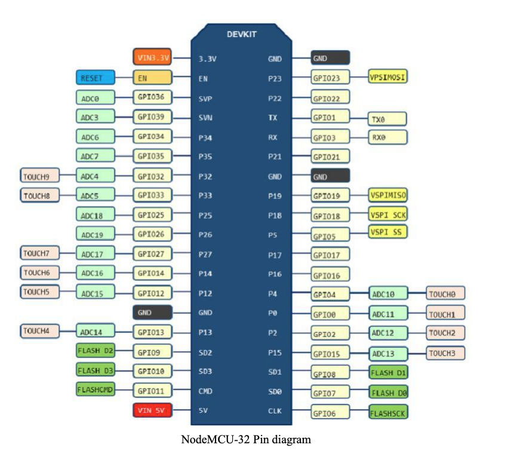

# LED Driver Exercise

This exercise demonstrates C++ object-oriented programming by implementing a multi-colored LED driver.

## Hardware Setup

Connect an RGB LED (common anode) to your ESP32:
- **Red**: GPIO 27
- **Green**: GPIO 26
- **Blue**: GPIO 25
- **Common Anode**: 3.3V (through a 100Ω resistor)

## What You'll Implement

### Part 1: Complete the `MultiColorLed` class
Open `src/led.cpp` and implement the TODO sections:
- Constructor initialization
- `on()`, `off()`, `toggle()` methods
- `set_color(red, green, blue)` method

### Part 2: Test your implementation
The main program in `src/main.cpp` cycles through different colors to test your LED driver.
