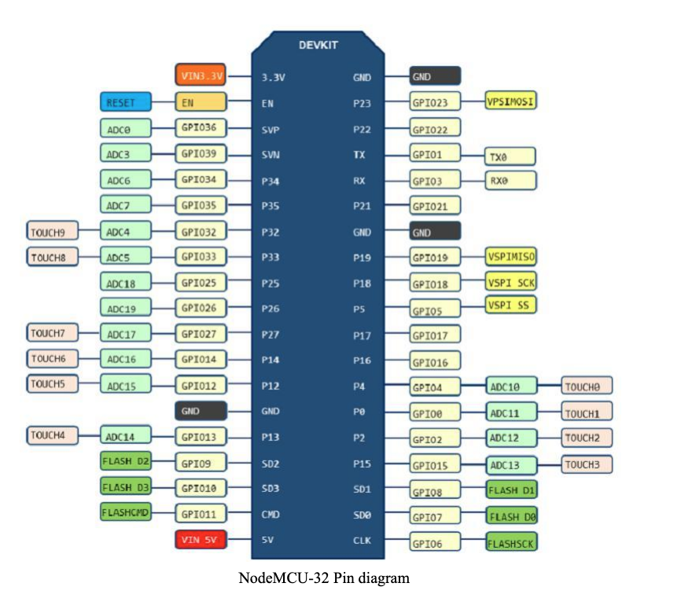

# Proximity Indicator Exercise

In modern Amazon fulfillment centers, autonomous mobile robots (AMRs) navigate crowded warehouse aisles to transport inventory pods and interact safely with human workers. These robots must constantly sense their surroundings and communicate their status to operators and nearby robots in a clear, intuitive way.

Your task is to design a Proximity Lighting Controller, an embedded C++ application that fuses data from an ultrasonic distance sensor and drives a multi-color LED indicator to display proximity state.

This component would form part of the Robot HMI (Human-Machine Interface) system used for safety signaling and diagnostics.

## Requirements

1. Measure distance continuously using the ultrasonic sensor

2. Determine safety state based on configurable distance thresholds

3. Update RGB LED color accordingly:

    🔴 Red: obstacle detected (stop zone)

    🟡 Yellow: caution zone

    🟢 Green: clear path

    🔵 Blue: idle or no obstacle

4. Handle sensor timeouts or errors with a distinct color (e.g. purple)

5. Log or print system state for debugging (as a stand-in for telemetry)

## Hardware Setup

Connect the components to your ESP32:

**RGB LED (common anode):**
(same as last exercise)
- **Red**: GPIO 27
- **Green**: GPIO 26  
- **Blue**: GPIO 25
- **Common Anode**: 3.3V (through a 100Ω resistor)

**HC-SR04 Ultrasonic Sensor:**
- **Trigger**: GPIO 16
- **Echo**: GPIO 17
- **VCC**: 3.3V
- **GND**: Ground

## What You'll Implement

The system changes LED colors based on distance measurements from the ultrasonic sensor. You'll complete three TODO sections in `src/main.cpp`:

### Part 1: Complete the Config Constructor
Write the parameterized constructor for the `Config` struct that takes the parameters as shown in the main function and assigns them to the member variables.

### Part 2: Implement Distance Measurement
Call the `measure_distance` method on the ultrasonic sensor and store the result in a variable named `status`.

### Part 3: Manage Distance History with STL Deque
Push the `distance_cm` to the `distance_history_` deque. If the size exceeds `cfg_.history_size`, remove the oldest entry. You'll need to research what a deque is and what methods to use.

## Resources

[What a dequeue is](https://www.geeksforgeeks.org/cpp/deque-cpp-stl/)
