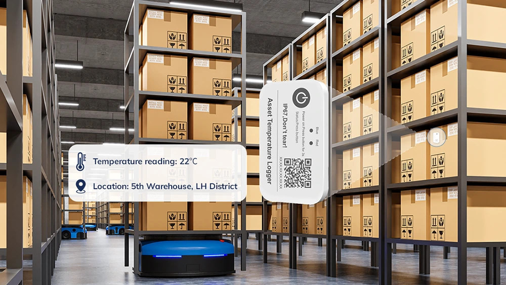

# Data Logger Exercise

You are part of an embedded systems engineering team designing a next-generation temperature monitoring solution for large-scale automated warehouses.

In this system, compact wireless temperature loggers are attached directly to storage racks and product boxes throughout the warehouse.

Each logger continuously measures and records environmental data to ensure:

- Product integrity: temperature-sensitive items (food, pharmaceuticals, electronics) remain within limits
- Worker safety & comfort: optimal storage conditions across vast facilities
- Regulatory compliance: validated, auditable data for inspections and traceability

## System Overview

Each embedded logger node functions as part of a distributed sensor network that captures and stores environmental readings near products in real time.

Your device must:

- Measure temperature using a TI TMP100 I²C temperature sensor every 10 minutes

- Store readings locally in a Microchip 24FC256 EEPROM for buffering and backup during network outages

- Operate 24/7 in warehouse environments subject to vibration, electrical noise, and temperature extremes

- Support centralized data collection, enabling automated climate control and compliance reporting

## Deployment context

Thousands of these loggers are installed across warehouses exceeding 1 million square feet, attached to boxes, pallets, and shelves.

Firmware must therefore be:

- Reliable: 99.9% uptime under continuous operation

- Scalable: capable of managing hundreds of devices per site

- Maintainable: minimal physical servicing or recalibration

## Your task

We will not code a solution for this one, rather, design the system on paper with a partner.

> Design a clear, modular, and realistic UML diagram that shows:
>- Class hierarchy (composition, dependencies)  
>- Major methods and data members  
>- Interfaces between application, drivers, and hardware

You should follow the system design steps to identify the classes needed, their interface, and produce a uml-like diagram that showcases your design.

To design your UML and system architecture, you’ll need to understand how the **temperature sensor** and **EEPROM** communicate and behave at the hardware level.  

Below is a summary of the most relevant details from their datasheets:

### TI TMP100 - Digital Temperature Sensor

| Feature | Description |
|----------|--------------|
| **Interface** | I²C (2-wire serial bus: SDA, SCL) |
| **Addressing** | 7-bit I²C address selectable using pins A0–A2 |
| **Measurement Range** | –55 °C to +125 °C |
| **Resolution** | 12-bit (0.0625 °C per LSB) |
| **Conversion Time** | ~26 ms typical for 12-bit mode |
| **Registers** | Temperature register, Configuration register, T_LOW / T_HIGH alarm thresholds |
| **Power** | Operates from 2.7 V to 5.5 V |
| **Alert Pin (optional)** | Can be configured as a thermostat output or interrupt line |

**Implications for your UML:**
- Requires a `TemperatureSensor` driver class using **I²C communication**.  
- The class should support reading a 2-byte temperature register and converting to Celsius.  
- You might include configuration methods (e.g., `set_resolution()`, `enable_alerts()`), or keep it minimal (`read_temperature()` only).  
- Include the I²C address as a class member variable or configuration constant.

### Microchip 24FC256 - 256-Kbit I²C EEPROM

| Feature | Description |
|----------|--------------|
| **Interface** | I²C (2-wire serial bus: SDA, SCL) |
| **Addressing** | 7-bit base address + 3 hardware-select pins (A0–A2) |
| **Memory Organization** | 32 KB total (32,768 × 8 bits) |
| **Page Write Size** | 64 bytes per write cycle |
| **Write Cycle Time** | ~5 ms typical per page |
| **Endurance** | 1,000,000 write/erase cycles typical |
| **Data Retention** | > 200 years (at 25 °C) |

**Implications for your UML:**
- Requires an `EepromStorage` driver class built around **paged I²C writes** and **sequential reads** 
- Include internal methods for `write_page(address, data)` and `read_page(address, buffer)`
- Consider simple logging interface methods like `append_record()` and `read_record(index)`
- Include address and page constants as private or `constexpr` members

### Common Interface Considerations

Both peripherals share the **I²C bus**, meaning your system will likely include:
- A `BusManager` or `I2CInterface` abstraction for shared access  
- Or the ESP-IDF’s `i2c_master_*()` API wrapped by lightweight driver classes  

Your UML should reflect:
- Each driver *depends on* an I²C interface (composition)  
- The main `DataLoggerApp` *uses* both drivers to coordinate measurement and storage  
- Configuration or timing logic lives in the **application layer**, not in the hardware drivers

## Design Hint
Think about what methods and members each class would need based on this information.  
For example:  
- `TemperatureSensor::read_temperature()` → returns a `float` in Celsius  
- `EepromStorage::write_record(float temperature)` → logs data to next address  
- `DataLoggerApp::run()` → coordinates sensor reads and EEPROM writes every 10 minutes  
